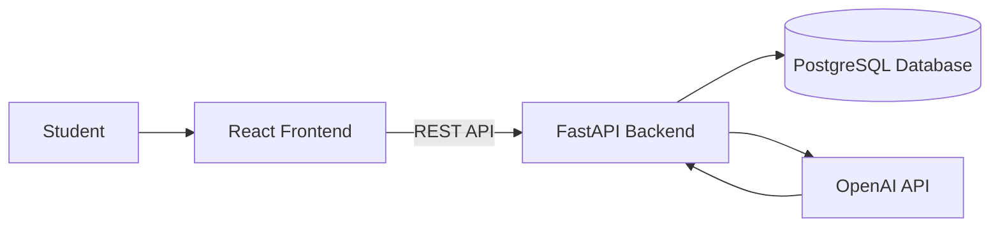

# StudySync AI

## Overview

StudySync AI is an AI-powered academic planning web application designed to help college students organize their courses, assignments, exams, deadlines, and study time in one centralized platform.

The application will analyze a student's academic workload and available study time to generate personalized study plans and recommendations.

## Main Features

* User registration and authentication
* Course management
* Assignment and exam tracking
* Deadline and priority management
* Academic calendar and dashboard
* Student study-time availability
* AI-generated personalized study plans
* Study progress tracking

## Technology Stack

### Frontend

* React
* TypeScript
* Vite
* Tailwind CSS

### Backend

* Python
* FastAPI
* SQLAlchemy

### Database

* PostgreSQL

### Authentication

* JWT authentication
* Secure password hashing

### AI

* OpenAI API

## System Architecture

## Project Team

* Kiamely Pereyra 
* Massiel Montero

## Project Status

Currently developing the project proposal and opportunity study for Milestone 1.
