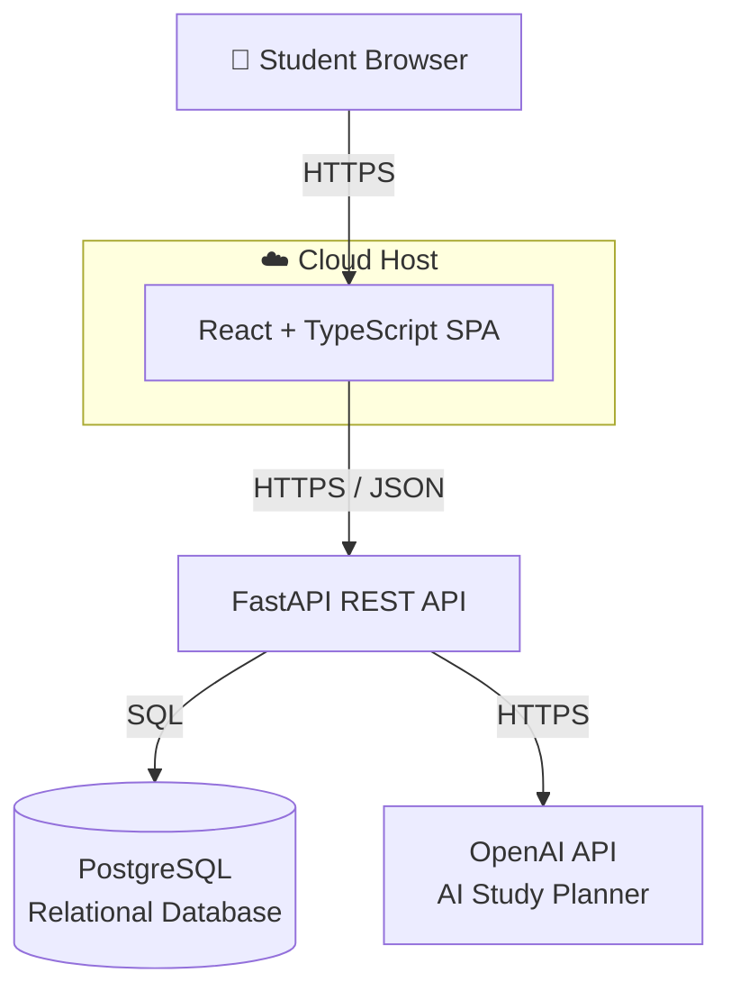

# StudySync AI
## Milestone 3 – Formal Analysis and Design

### System Architecture Diagram

The following diagram shows the high-level architecture of StudySync AI and the communication between the main system components.

### Architecture Description

The student accesses StudySync AI through a web browser. The React and TypeScript frontend provides the user interface and communicates with the FastAPI REST API using HTTPS and JSON.

The FastAPI backend handles application requests and communicates with the PostgreSQL relational database to store and retrieve student information, courses, assignments, exams, study availability, and other academic data.

The backend also communicates with the OpenAI API through HTTPS when AI-powered study planning is requested. The AI service returns generated study recommendations to the backend, which then sends the results to the frontend for the student to view.