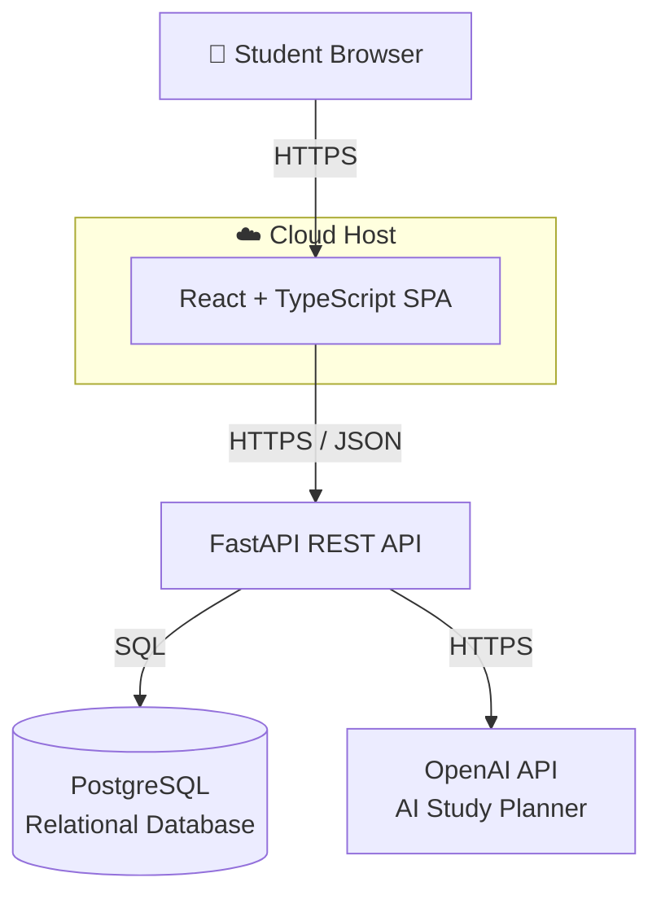

# StudySync AI
## Milestone 3 – Formal Analysis and Design

### System Architecture Diagram

The following diagram shows the high-level architecture of StudySync AI and the communication between the main system components.

### Architecture Description

The student accesses StudySync AI through a web browser. The React and TypeScript frontend provides the user interface and communicates with the FastAPI REST API using HTTPS and JSON.

The FastAPI backend handles application requests and communicates with the PostgreSQL relational database to store and retrieve student information, courses, assignments, exams, study availability, and other academic data.

The backend also communicates with the OpenAI API through HTTPS when AI-powered study planning is requested. The AI service returns generated study recommendations to the backend, which then sends the results to the frontend for the student to view.
### Class Diagram

The following class diagram shows the main classes used in StudySync AI, including their attributes, methods, and relationships. It represents the structure needed to support user authentication, academic tasks, study availability, and AI-generated study plans.

```mermaid
classDiagram

    class User {
        -int id
        -string name
        -string email
        -string passwordHash
        +login(string email, string password) bool
    }

    class Course {
        -int id
        -int userId
        -string name
        -string code
        +createCourse() Course
        +updateCourse() Course
        +deleteCourse() bool
    }

    class AcademicTask {
        -int id
        -int courseId
        -string title
        -string taskType
        -date deadline
        -int difficulty
        -float estimatedHours
        +createTask() AcademicTask
        +updateTask() AcademicTask
        +deleteTask() bool
    }

    class StudyAvailability {
        -int id
        -int userId
        -datetime startTime
        -datetime endTime
        +addAvailability() StudyAvailability
        +updateAvailability() StudyAvailability
        +deleteAvailability() bool
    }

    class StudyPlan {
        -int id
        -int userId
        -datetime generatedAt
        -string planContent
        +generatePlan() StudyPlan
    }

    class AuthService {
        +login(string email, string password) string
        +register(string name, string email, string password) User
    }

    class TaskService {
        +createTask(int userId, int courseId, AcademicTask task) AcademicTask
        +getUpcomingTasks(int userId) List~AcademicTask~
        +updateTask(int taskId, AcademicTask task) AcademicTask
        +deleteTask(int taskId) bool
    }

    class StudyPlanService {
        +generateStudyPlan(int userId) StudyPlan
        +validatePlanningData(List~AcademicTask~ tasks, List~StudyAvailability~ availability) bool
    }

    class UserRepository {
        <<interface>>
        +findByEmail(string email) User
        +save(User user) User
    }

    class TaskRepository {
        <<interface>>
        +save(AcademicTask task) AcademicTask
        +getUpcomingTasks(int userId) List~AcademicTask~
        +update(AcademicTask task) AcademicTask
        +delete(int taskId) bool
    }

    class AvailabilityRepository {
        <<interface>>
        +getAvailability(int userId) List~StudyAvailability~
        +save(StudyAvailability availability) StudyAvailability
    }

    class AIStudyPlanner {
        <<interface>>
        +generate(List~AcademicTask~ tasks, List~StudyAvailability~ availability) StudyPlan
    }

    class OpenAIStudyPlanner {
        +generate(List~AcademicTask~ tasks, List~StudyAvailability~ availability) StudyPlan
    }

    User "1" *-- "0..*" Course : owns
    Course "1" *-- "0..*" AcademicTask : contains
    User "1" *-- "0..*" StudyAvailability : defines
    User "1" *-- "0..*" StudyPlan : receives

    AuthService --> UserRepository : uses
    TaskService --> TaskRepository : uses
    StudyPlanService --> TaskRepository : reads tasks
    StudyPlanService --> AvailabilityRepository : reads availability
    StudyPlanService --> AIStudyPlanner : requests plan

    AIStudyPlanner <|.. OpenAIStudyPlanner : implements
```

#### Class Diagram Description

The `User` class represents a student account. Each user can own multiple courses, define multiple study availability periods, and receive multiple generated study plans. Each `Course` can contain multiple `AcademicTask` objects representing assignments or exams.

The service classes contain the application logic for authentication, task management, and study-plan generation. Repository interfaces separate the application logic from database access. The `AIStudyPlanner` interface separates AI functionality from the rest of the application, while `OpenAIStudyPlanner` represents the planned implementation using the OpenAI API.

The `StudyPlanService` retrieves upcoming academic tasks and available study periods before requesting a study plan. This supports the requirement that the system verify that the required planning information is available before attempting AI generation.